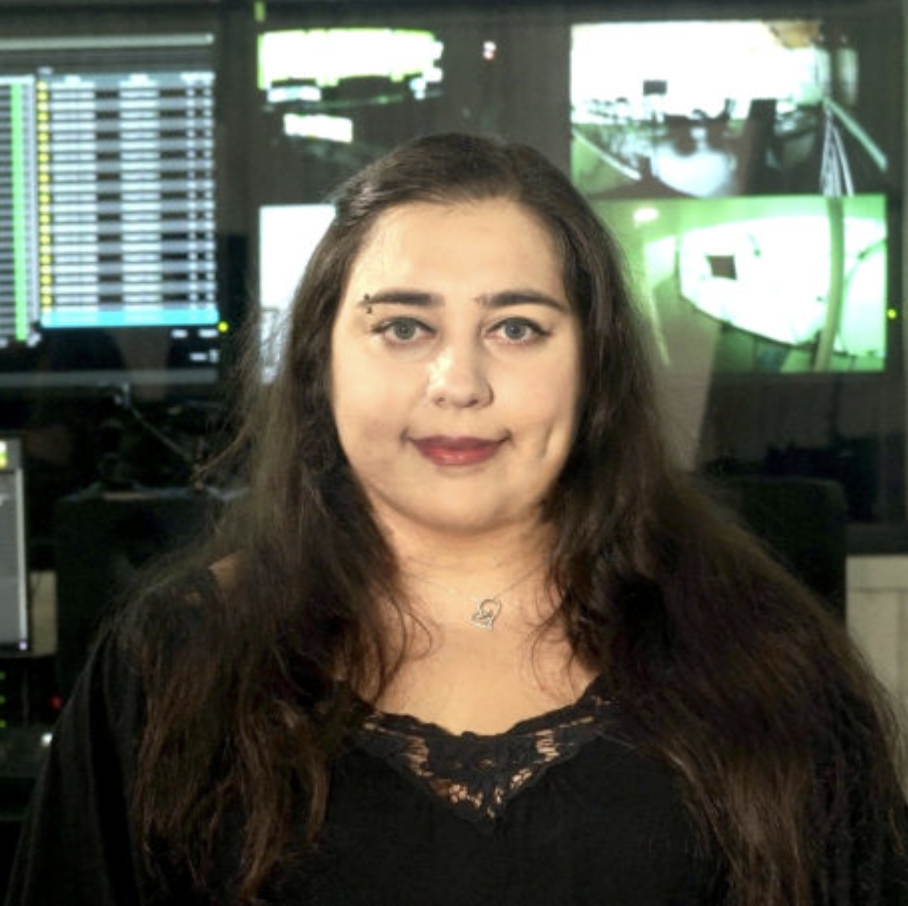
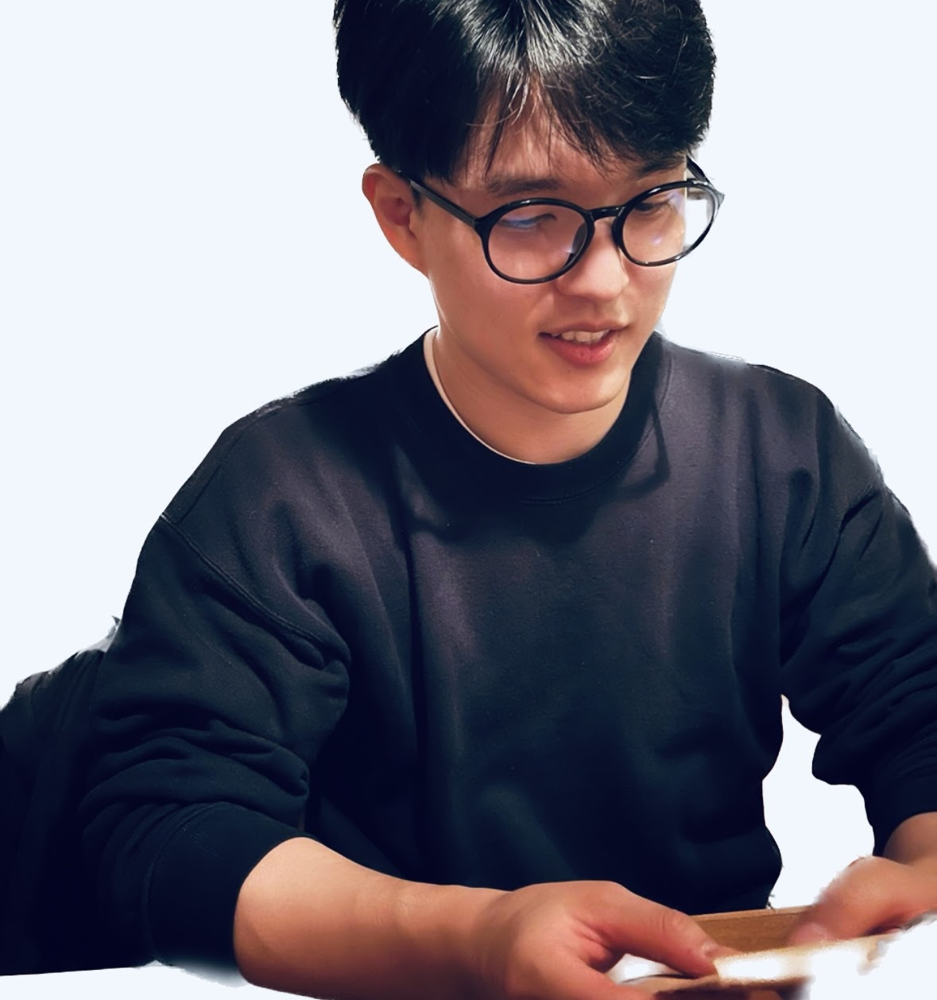

# Responsibly Building Generative Models @ ECCV 2024
---
Proposal Website for Responsibly Building Generative Models Tutorial at ECCV 2024, *TBD* 

Hosted by [Gowthami Somepalli](https://somepago.github.io/) (UMD), [Changhoon Kim](https://www.changhoonkim.com/) (ASU), [Tejas Gokhale](https://www.tejasgokhale.com/) (UMBC), [Kyle Min](https://sites.google.com/view/kylemin) (Intel Labs), [Yezhou Yang](https://yezhouyang.engineering.asu.edu/) (ASU) and [Tom Goldstein](https://www.cs.umd.edu/~tomg/) (UMD)

## Agenda
Over the past few years, generative models have evolved from simple research concepts to production-ready tools, dramatically reshaping the tech landscape. Their outstanding generative capabilities have gained traction in various sectors, such as entertainment, art, journalism, and education. However, a closer look reveals that these models face several reliability issues that can impact their widespread adoption. A primary concern is the models' ability to memorize training data, which might result in copyright breaches. Reliability concerns also encompass the model's occasional failure to accurately follow prompts, inherent biases, misrepresentations, and hallucinations. Moreover, with increasing awareness, issues related to privacy and potential misuse underscore the urgent need to safeguard these models. To move forward responsibly with these models, we must adopt solutions to address memorization challenges, robust evaluation systems, and active fingerprinting solutions. These measures will help monitor the progress and ensure responsible and effective use of image-generative models.

In this tutorial, we will emphasize on the issues discussed above and the attendees will get an opportunity to learn about:
- The state-of-the-art image generative models and their associated reliability concerns,
- Training data memorization in diffusion models and some mitigation strategies,
- Techniques for incorporating fingerprint into model weights to trace malicious content origins,
- Methods to quantify and critically assess the inherent biases and potential failure modes within image generative models.

## Tentative Schedule
<table>
	<tr>
		<th width="15%"> Time (UTC-10) </th>
		<th width="40%"> Topic </th>
		<th> Presenter </th>
	</tr>
	<tr>
    	<td> 10 min </td>
    	<td> Evolving Landscape of Generative Models: Progress and Pitfalls </td>
			<td valign="center"> 
			<!-- Speaker 1 Image and Link -->
			<a href="https://somepago.github.io/">Gowthami Somepalli</a> (Ph.D. Candidate, UMD)<br/>
			<!-- Speaker 2 Image and Link -->
			<a href="https://changhoonkim.github.io/">Changhoon Kim</a> (Ph.D. Candidate, ASU)
			</td>
	</tr>
	<tr>
		<td> 30+5 min </td>
		<td> Understanding training data memorization in diffusion models and ways to mitigate it </td>
		<td valign="center"> 
			   
			<a href="https://somepago.github.io/">Gowthami Somepalli</a> <br/> (Ph.D. Candidate, UMD)
		</td>
	</tr>
	<tr>
		<td> 30+5 min </td>
		<td>  Erasing Concepts in Diffusion Models </td>
		<td valign="center"> 
			   
			<a href="https://baulab.info/">David Bau</a> <br/> (Assistant Professor, NEU)
		</td>
	</tr>
	<tr>
		<td> 30+5 min </td>
		<td> Instructing Generative Image Models on Fairness and Safety </td>
		<td valign="center"> 
			   
			<a href="https://ml-research.github.io/people/pschramowski/">Patrick Schramowski</a> <br/> (Researcher, DFKI)
		</td>
	</tr>
	<tr>
		<td> 30+5 min </td>
		<td> Deepfake Detection </td>
		<td valign="center"> 
			   
			<a href="https://ilkedemir.weebly.com/">Ilke Demir</a> <br/> (Sr. Staff Research Scientist, Intel Labs)
		</td>
	</tr>
	<tr>
		<td> 40+5 min </td>
		<td> Attribution and Fingerprinting of Image Generative Models </td>
		<td valign="center"> 
			   
			<a href="https://www.changhooonkim.com/">Changhoon Kim</a> <br/> (PhD Candidate, ASU)
		</td>
	</tr>
	<tr>
		<td> 40+5 min </td>
		<td> Challenges with Evaluation of Text-to-Image Models </td>
		<td valign="center"> 
			   
			<a href="https://www.tejasgokhale.com/">Tejas Gokhale</a> <br/> (Assistant Professor, UMBC)
		</td>
	</tr>
</table>


---
*This website will be updated closer to the event date.*


```
We acknowledge support from NSF Robust Intelligence grant #2132724
```
